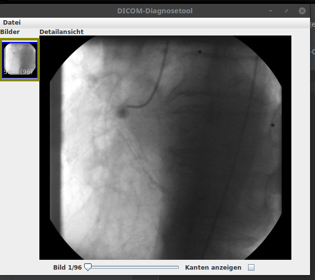
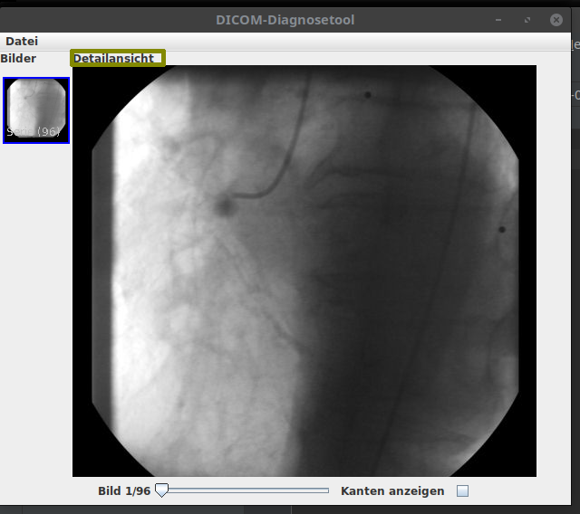
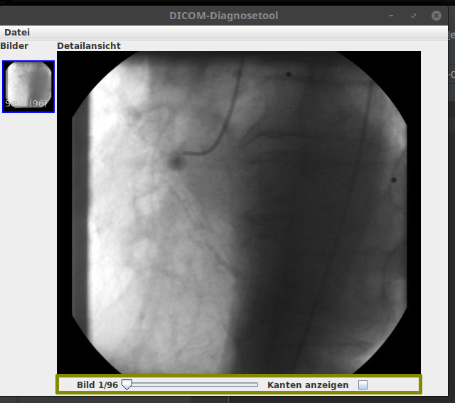

# DICOM-Teilaufgabe 2

In dieser Woche beginnen wir, das GUI zur Anzeige der DICOM-Dateien (in Anlehnung an Ihre Ergebnisse aus dem Workshp) zu implementieren.

Auch hier lohnt es sich, zunächst die komplette Aufgabenstellung zu lesen um die Zusammenhänge und den Programmaufbau zu verstehen, bevor Sie mit der Implementation beginnen, und dann schrittweise vorzugehen (also z. B. zuerst das ```MainFrame``` mit drei ```JLabel```, um zu sehen, dass es ein Fenster gibt und Sie die Labels da sehen, wo diese hingehören; dann um ein ```ImageListPanel```, das nichts außer dem Titel-Label anzeigt erweitern; dann ein ```ImageDetailPanel``` hinzufügen, das einfach nur ein rotes Viereck mit der richtigen Größe zeichnet - und so weiter und so fort).

Bevor wir beginnen, noch ein Hinweis zu der Implementation von GUIs: Jede ```JComponent``` hat eine Methode ```setBorder```, mit der Sie einen Rahmen definieren können, der um die Komponente herum gezeichnet wird (natürlich nur, wenn Sie ```paintComponent``` entweder nicht überschreiben oder darin ```super.paintComponent(g)``` aufrufen). Ein beispielhafter Aufruf wäre ```setBorder(new LineBorder(Color.GREEN));```. Das ist äußerst hilfreich, wenn Komponenten sich seltsam verhalten, denn dadurch kann man erkennen, wie groß sie im Layout tatsächlich sind. 

## DICOMImage

Erweitern Sie zunächst dafür DICOMImage um die folgenden zwei Hilfsmethoden:

* ```public void getFrame(int num)```: Gibt das ```DICOMFrame``` mit der entsprechenden Nummer zurück.
* ```public int getNumFrames()```: Gibt die Anzahl der frames im dem Bild zurück.


## GUI

Implementieren Sie dann die Klassen für das GUI.

### Gesamtüberblick

Zunächst hier ein Gesamtüberblick über das Layout und wie die einzelnen Komponenten darin zum Einsatz kommen:

#### ImageListPanel

Das ```ImageListPanel``` steht auf der linken Seite (```BorderLayout.WEST```) und zeigt oben die Überschrift "Bilder" (ein ```JLabel```) sowie die geladene Bildserie und später die markierten Bilder daraus an:


#### SeriesThumbnail

Das ```SeriesThumbnail``` wird dem ```ImageListPanel``` hinzugefügt, wenn ein Bild geladen wird:



#### Detailansicht

Das ```JLabel``` "Detailansicht" ist einfach nur ein ```JLabel``` das direkt im ```MainFrame``` oben (```BorderLayout.NORTH```) angezeigt wird:



#### ImageDetailPanel

Das ```ImageDetailPanel``` liegt direkt im ```MainFrame``` in der Mitte (```BorderLayout.CENTER```) und zeigt das selektierte Bild/Frame an:


#### Kontrollelemente

Die Kontrollelemente sind zusammen in einem ```JPanel``` gruppiert, welches direkt im ```MainFrame``` unten (```BorderLayout.SOUTH```) liegt:




### MainFrame

Implementieren Sie eine Klasse ```MainFrame```, die von ```JFrame``` erbt und das Gesamtfenster darstellt. Verwenden Sie hier das ```BorderLayout``` (siehe [Oracle-Dokumentation](https://docs.oracle.com/javase/tutorial/uiswing/layout/border.html)). Sie soll folgende Methoden enthalten (es geht auch ohne, aber das sind Hinweise für Hilfsmethoden, die bei der Kommunikation zwischen den Komponenten helfen und Ihnen bei der Implementation der einzelnen Listener helfen werden):

* Einen Constructor, der das Layout (gerne in Untermethoden organisiert) macht. Es soll dabei zwei Menü-Einträge in dem Menü "Datei" geben:
    * Öffnen - zeigt einen ```JFileChooser``` zum Laden einer .DCM-Datei an und benachrichtigt entsprechend das ```ImageListPanel``` wenn eine Datei ausgewählt wurde
    * Beenden - beendet das Programm über ```System.exit(0)```
* ```public void setDetailFrame(DICOMFrame frame, boolean showEdges)```: Benachrichtigt das ```ImageDetailPanel```, das ein bestimmter ```DICOMFrame``` angezeigt werden soll. Hinweis: An dieser Stelle ist es sinnvoll, ein ```revalidate()``` und ein ```repaint()``` zu machen, um die komplette Anzeige (inklusive der nun veränderten Anzeige des Bildes) zu aktualisieren.
* ```public void setDetailSeries(DICOMImage image)```: Aktualisiert die Einstellungen des Bilder-Sliders (der als Maximum-Wert die Anzahl der Frames im Bild haben sollte) und setzt die Detailansicht auf den ersten Frame des Bildes (am besten über ```setDetailFrame```).
* ```public void updateDetailView()```: Setzt (am besten über ```setDetailFrame```) den angezeigten Frame auf den, welcher über den Slider (an den Wert kommt man über ```JSlider.getValue()```) selektiert ist. Aktualisiert außerdem den Text in dem Label neben dem Slider (also "Bild X/Y").
* ```public void setPreviousDetailFrame()```: Setzt den angezeigten Frame auf den Frame vor dem, der jetzt angezeigt wird. Hinweis: Wenn Sie den Wert eines Sliders programmatisch über ```JSlider.setValue()``` verändern, dann wird der ```ChangeListener``` des ```JSlider``` genau so benachrichtigt, wie wenn die Veränderung durch den Benutzer mit der Maus vorgenommen wird.
* ```public void setNextDetailFrame()```: Wie ```setPreviousDetailFrame()```, nur dass der nächste und nicht der vorherige Frame angezeigt wird.

In ```MainFrame``` sollten Sie auch die ```ActionListener``` für die ```JMenuItem``` und die ```JCheckBox``` neben dem ```JLabel``` "Kanten Anzeigen" implementieren, sowie den ```ChangeListener``` für den ```JSlider``` zur Auswahl des angezeigten Frames.

Erstellen Sie für die Kontrollelemente unten (die 2 ```JLabel```, den ```JSlider``` und die ```JCheckBox```) ein ```JPanel``` mit einem ```FlowLayout```, welchem Sie die Kontrollelemente hinzufügen. Fügen Sie dann das ganze ```JPanel``` im ```MainFrame``` in ```BorderLayout.SOUTH``` hinzu - dadurch erreichen Sie die Gruppierung der Elemente unten im Fenster.

#### ImageListPanel

Das ```ImageListPanel``` zeigt das geladene Bild sowie später die markierten Frames daraus an. Es sollte von ```JPanel``` erben.

Übergeben Sie an den Constructor eine Instanz von ```MainFrame``` (wenn Sie aus dem ```MainFrame``` heraus das ```ImageListPanel``` erstellen, müssen Sie also als Argument ```this```) übergeben. Das ist nötig, damit Sie über die in ```MainFrame``` implementierten Methoden die Anzeige der Bildserie steuern können. In Programmierung 3 werden Sie eine sauberere Methode kennenlernen, diese Kommunikation innerhalb des Programms zu lösen (das Model-View-Control-Designpattern), aber das würde an dieser Stelle zu weit führen.

Verwenden Sie in ```ImageListPanel``` ein ```BoxLayout``` (siehe [Oracle-Dokumentation](https://docs.oracle.com/javase/tutorial/uiswing/layout/box.html)) und fügen Sie zunächst ein ```JLabel``` "Bilder" hinzu. Denken Sie daran, dass Sie die Ausrichtung der einzelnen Elemente über ```setAlignmentX()``` und ```setAlignmentY()``` beeinflussen können und die präferierte Größe der Komponente mit ```setPreferredSize()```. Horizontale und vertikale Abstände können Sie im ```BoxLayout``` mit ```Box.createVerticalStrut()``` und ```Box.createHorizontalStrut()``` erzeugen.  

Implementieren Sie in ```ImageListPanel``` eine Methode ```public void setImage(DICOMImage newImage)```, die ein ```SeriesThumbnail``` mit dem ersten Frame des übergebenen ```DICOMImage``` erstellt und dem ```BoxLayout``` hinzufügt. Geben Sie dem ```SeriesThumbnail``` einen ```MouseListener``` der, wenn die Maus geklickt wird, über ```MainFrame.setDetailSeries``` das von dem ```SeriesThumbnail``` angezeigte ```DICOMImage``` anzeigen lässt.

#### SeriesThumbnail

Das ```SeriesThumbnail``` erbt ebenfalls von ```JPanel``` und zeigt einen Thumbnail für ein DICOM-Bild an.

Der Contructor ```public SeriesThumbnail(DICOMImage dicomimage, int size, int border)``` sollte eine auf ```size-2*border```x```size-2*border``` skalierte Version des ersten Frames des übergebenen ```DICOMImage``` speichern. Denken Sie auch hier daran, über ```setPreferredSize``` die Größe zu setzen.

Implementieren Sie zudem die folgenden zwei Hilfsmethoden:
* ```public void setSelected(boolean selected)```: Merkt sich, ob der Thumbnail aktuell ausgewählt ist oder nicht
* ```public String getDescription()```: Gibt die Beschreibung der Serie zurück: "Serie (<Anzahl der Frames in der Serie>".

Überschreiben Sie dann die Methode ```public void paintComponent(Graphics g)```: Malen Sie in dieser Methode das im Constructor erstellte skalierte Bild (nicht bei den Koordinaten 0, 0 sondern bei den Koordinaten border, border - dann klebt das Bild nicht am rechten Rand) und schreiben Sie unten die über ```getDescription``` generierte Beschreibung hin. Falls der Thumbnail selektiert ist, malen Sie zudem (mittels ```drawRect()```) einen blauen Rahmen um das Bild.

#### ImageDetailPanel

Das ```ImageDetailPanel``` erbt auch von ```JPanel``` und zeigt einen Frame eines DICOM-Bildes in voller Größe an. 

Wie beim ```ImageListPanel``` sollte auch das ```ImageDetailPanel``` im Constructor eine Instanz von ```MainFrame``` erhalten. 

Das ```ImageDetailPanel``` braucht neben dem Constructor vorerst nur zwei Methoden:
* ```public void setDetailFrame(DICOMFrame frame, boolean showEdges)```: Setzt die Nummer des anzuzeigenden Frames und ob das Originalbild oder die Kanten angezeigt werden sollen.
* ```public void paintComponent(Graphics g)```: Falls noch kein Frame gesetzt wurde, wird nur in schwarzer Schrift "Bitte ein Bild laden" angezeigt. Sonst wird - je nachdem ob ```showEdges``` ```true``` oder ```false``` ist - das Originalbild oder das Ergebnis der Kantendetektion (vorerst nur mit dem Standardwert 10 für brightness) gemalt.

Fügen Sie zuletzt im Constructor dem ```ImageDetailPanel``` einen ```MouseWheelListener``` hinzu der, wenn das Mausrad gedreht wurde, je nach Richtung ```MainFrame.setPreviousDetailFrame()``` oder ```MainFrame.setNextDetailFrame()``` aufruft.

## Abgabe

Im Ordner ```Bilder``` finden Sie eine Datei ```DICOM-2.mp4```, die in einigen Sekunden kurz die Bedienung der beschriebenen Elemente des Programms zeigt.

Fügen Sie Ihrem Repository ebenfalls im Ordner ```Bilder``` ein maximal 30-sekündiges Video hinzu, das auf ähnliche Art die Bedienung Ihres Programms zeigt. Die Videodatei sollte nicht größer als 5 MB sein.